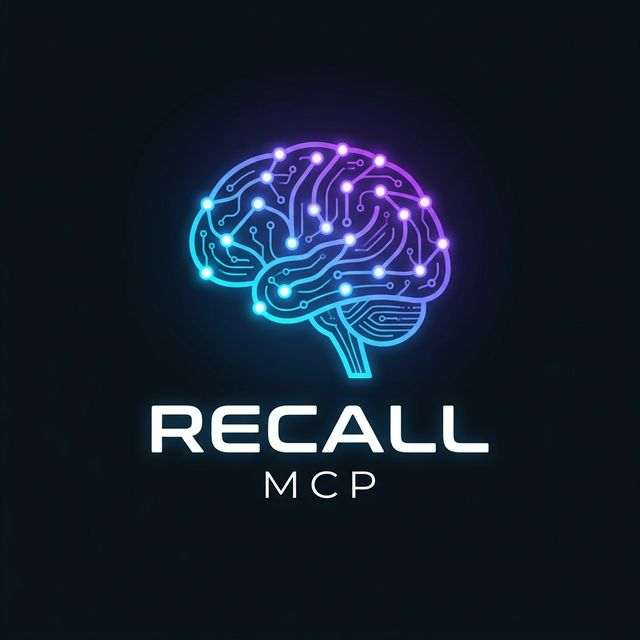

<p align="center">
  
</p>

<h1 align="center">🧠 Recall MCP</h1>

<p align="center">
  <strong>A Shared Brain for AI Agents</strong><br/>
  <em>SQLite-backed persistent memory system running on the Model Context Protocol (MCP)</em>
</p>

<p align="center">
  <a href="#features"></a>
  <a href="#tech-stack"></a>
  <a href="#docker"></a>
  <a href="LICENSE"></a>
  <a href="#hybrid-search"></a>
</p>

---

## What is Recall MCP?

**Recall MCP** is a fully local, offline-first **persistent memory system** that gives your AI agents the ability to **remember, search, and forget** information across sessions. It runs as an Express.js web server using **Server-Sent Events (SSE)** transport, secured by Bearer token authentication.

Think of it as a **shared brain** — multiple AI agents (Claude, Gemini, Codex, or any MCP-compatible client) can connect to the same memory database simultaneously, enabling cross-agent knowledge sharing.

```
┌──────────────┐     ┌──────────────┐     ┌──────────────┐
│   Claude     │     │   Gemini     │     │   Codex      │
│   Desktop    │     │  Antigravity │     │    CLI       │
└──────┬───────┘     └──────┬───────┘     └──────┬───────┘
       │                    │                    │
       │    MCP Protocol    │    MCP Protocol    │
       │   (stdio → SSE)    │   (stdio → SSE)    │
       │                    │                    │
       ▼                    ▼                    ▼
  ┌─────────────────────────────────────────────────┐
  │              🧠  RECALL MCP SERVER              │
  │         Express.js + SSE + Bearer Auth          │
  ├─────────────────────────────────────────────────┤
  │  📦 SQLite        │  🔍 FTS5 Full-Text Search   │
  │  🧬 sqlite-vec    │  🤖 384-dim Vector Embed    │
  │  ♻️  Garbage       │  🔐 Token Authentication    │
  │     Collector      │  🌐 Multi-Agent Sessions    │
  └─────────────────────────────────────────────────┘
                        │
                  ┌─────┴─────┐
                  │  SQLite   │
                  │  Database │
                  └───────────┘
```

---

## ✨ Features

| Feature | Description |
|---|---|
| 🔍 **Hybrid Search** | Combines FTS5 full-text search with 384-dimensional vector similarity for the best of both worlds |
| 🧬 **Local Embeddings** | Uses `@xenova/transformers` (MiniLM-L6-v2) — 100% offline, no API keys needed |
| 📦 **SQLite Everything** | Single file database with `better-sqlite3` + `sqlite-vec` extension for vector operations |
| 🔐 **Bearer Token Auth** | All endpoints secured with token-based authentication |
| 🌐 **Multi-Agent Support** | Multiple AI agents can connect and share the same memory simultaneously via SSE |
| ♻️ **Memory Decay & GC** | Automatic garbage collection with configurable decay rules (STRONG → MEDIUM → WEAK) |
| 🏷️ **Rich Metadata** | Namespaces, categories, tags, weights, expiration dates, and session tracking |
| 🐳 **Docker Ready** | One command to build and run with persistent volumes |
| 🔌 **Proxy Bridge** | Included `proxy.js` bridges stdio-based MCP clients to the SSE server |

---

## 🚀 Quick Start

### Option 1: Docker (Recommended)

```bash
# Clone the repository
git clone https://github.com/mturac/recall-mcp.git
cd recall-mcp

# Configure your secret token
cp .env.example .env
# Edit .env and set RECALL_AUTH_KEY to a strong secret

# Build and run
docker-compose up -d

# ✅ Server is now running at http://localhost:4000
```

### Option 2: Local Development

```bash
# Install dependencies
npm install

# Configure environment
cp .env.example .env

# Run in development mode
npm run dev

# Run tests
npm test
```

---

## 🔧 Configuration

Create a `.env` file from the example:

```env
PORT=3000
RECALL_AUTH_KEY=your_super_secret_token_here
```

| Variable | Default | Description |
|---|---|---|
| `PORT` | `3000` | Server port (inside Docker) |
| `RECALL_AUTH_KEY` | — | **Required.** Bearer token for API authentication |
| `DB_PATH` | `data/recall_brain.db` | Path to the SQLite database file |

---

## 🔌 Connecting AI Agents

Recall MCP uses a **proxy bridge** (`proxy.js`) to translate between stdio-based MCP clients and the SSE server running in Docker.

### Claude Desktop

Edit `~/Library/Application Support/Claude/claude_desktop_config.json`:

```json
{
  "mcpServers": {
    "recall-memory": {
      "command": "node",
      "args": ["/path/to/recall-mcp/proxy.js"],
      "env": {
        "RECALL_URL": "http://localhost:4000/sse",
        "RECALL_TOKEN": "your_secret_token"
      }
    }
  }
}
```

### OpenAI Codex CLI

Edit `~/.codex/config.toml`:

```toml
[mcp_servers.recall-memory]
command = "node"
args = ["/path/to/recall-mcp/proxy.js"]
env = { RECALL_URL = "http://localhost:4000/sse", RECALL_TOKEN = "your_secret_token" }
```

### Gemini (Antigravity)

Edit `~/.gemini/antigravity/mcp_config.json`:

```json
{
  "mcpServers": {
    "recall-memory": {
      "command": "node",
      "args": ["/path/to/recall-mcp/proxy.js"],
      "env": {
        "RECALL_URL": "http://localhost:4000/sse",
        "RECALL_TOKEN": "your_secret_token"
      }
    }
  }
}
```

---

## 🛠️ MCP Tools

Once connected, agents have access to **5 tools**:

### `recall_remember`
Store a new memory in the shared brain.

```json
{
  "content": "The deployment uses Kubernetes on GCP",
  "category": "project",
  "weight": "STRONG",
  "tags": ["infra", "k8s"],
  "namespace": "global"
}
```

**Categories:** `fact` · `preference` · `project` · `episodic` · `instruction` · `general`  
**Weights:** `STRONG` · `MEDIUM` · `WEAK`

### `recall_search`
Search memories using full-text, semantic, or hybrid search.

```json
{
  "query": "deployment infrastructure",
  "mode": "hybrid",
  "limit": 10
}
```

**Modes:**
- `fts` — SQLite FTS5 full-text search (fast, keyword-based)
- `semantic` — Vector similarity search using cosine distance (meaning-based)
- `hybrid` — Combined ranking from both FTS and vector search (recommended)

### `recall_get`
Retrieve a specific memory by its ID.

### `recall_forget`
Delete or weaken a memory.

```json
{
  "id": "memory_id_here",
  "mode": "delete"  // or "weaken"
}
```

### `recall_digest`
Get a formatted markdown summary of all strong and medium memories in a namespace.

---

## ♻️ Memory Lifecycle

Recall MCP implements an automatic **memory decay system** inspired by human memory:

```
                    7 days                14 days
  ┌─────────┐  ──────────▶  ┌──────────┐  ──────────▶  ┌────────┐
  │ STRONG  │               │ MEDIUM   │               │ WEAK   │
  └─────────┘               └──────────┘               └────────┘
                                                            │
                                                     (eventually
                                                      expired)
```

| Rule | Behavior |
|---|---|
| **STRONG → MEDIUM** | After 7 days of no update |
| **MEDIUM → WEAK** | After 14 days of no update |
| **Expired memories** | Hard deleted when `expires_at` is past |
| **Instructions** | Category `instruction` is **immune** to decay |

The garbage collector runs automatically on a configurable interval.

---

## 🏗️ Tech Stack

| Component | Technology |
|---|---|
| **Runtime** | Node.js 20+ (ESM) |
| **Language** | TypeScript 5.3+ |
| **Web Server** | Express.js |
| **Transport** | Server-Sent Events (SSE) |
| **Database** | SQLite via `better-sqlite3` |
| **Vector Search** | `sqlite-vec` (384-dim float32) |
| **Embeddings** | `@xenova/transformers` (MiniLM-L6-v2) |
| **Protocol** | Model Context Protocol (MCP) SDK |
| **Container** | Docker + Docker Compose |

---

## 📁 Project Structure

```
recall-mcp/
├── src/
│   ├── index.ts              # Express server, MCP tools, SSE transport
│   ├── db/
│   │   └── client.ts         # SQLite setup, schema, FTS5, vec0 tables
│   ├── embedding/
│   │   └── embedder.ts       # Local transformer-based embedding engine
│   └── utils/
│       └── gc.ts             # Garbage collector with memory decay logic
├── test/
│   └── recall.test.ts        # Comprehensive vitest test suite
├── proxy.js                  # Stdio ↔ SSE bridge for MCP clients
├── Dockerfile                # Multi-stage Docker build
├── docker-compose.yml        # Production-ready compose configuration
├── .env.example              # Environment variable template
├── package.json
└── tsconfig.json
```

---

## 🧪 Testing

Tests use **Vitest** with a fully mocked embedder (no model download required) and in-memory SQLite:

```bash
npm test
```

**Test coverage includes:**
- ✅ Authentication (401 without token, 200 with valid token)
- ✅ Database triggers (FTS5 auto-population)
- ✅ Hybrid search via MCP client
- ✅ Garbage collector memory decay
- ✅ Instruction category immunity

---

## 🗺️ Roadmap

- [ ] Web-based memory browser UI
- [ ] Multi-namespace access control
- [ ] Memory import/export (JSON, Markdown)
- [ ] Webhook notifications on memory events
- [ ] Embedding model selection (configurable)
- [ ] Clustering and memory deduplication
- [ ] Rate limiting per agent/session

---

## 🤝 Contributing

Contributions are welcome! Please feel free to submit a Pull Request.

1. Fork the repository
2. Create your feature branch (`git checkout -b feature/amazing-feature`)
3. Commit your changes (`git commit -m 'Add amazing feature'`)
4. Push to the branch (`git push origin feature/amazing-feature`)
5. Open a Pull Request

---

## 📄 License

This project is open source and available under the [MIT License](LICENSE).

---

<p align="center">
  <sub>Built with 🧠 by <a href="https://github.com/mturac">Mehmet Turaç</a></sub><br/>
  <sub>Give your AI agents the gift of memory.</sub>
</p>

---

## Part of [mturac/tools](https://github.com/mturac/tools)

This project is part of an open-source toolkit for AI-augmented engineering — Claude Code plugins, MCP servers, security scanners, schedulers, and dev-productivity utilities. See the [hub](https://github.com/mturac/tools) for the full list.

Install every Claude Code plugin from one place:

```text
/plugin marketplace add mturac/claude-plugin-marketplace
/plugin install recall-mcp
```

